# Money Monitor

A self-hosted personal finance platform that automatically scrapes transaction data from Israeli banks and credit cards, stores everything locally, and provides AI-powered analytics through an interactive dashboard.

## Features

- **Automatic Bank Scraping** — Connects to 9 Israeli banks and 8 credit card providers via headless browser automation
- **AI Financial Advisor** — Chat with Claude about your spending habits, get category suggestions, detect recurring charges, and compare periods
- **Interactive Dashboard** — Real-time charts, spending breakdowns, transaction search, and account management
- **Scheduled Scraping** — Configurable cron-based background scraping with live progress via SSE
- **Encrypted Credentials** — Bank login details encrypted with AES-256-GCM, never stored in plaintext
- **Local-First** — All data stays on your machine in a SQLite database. No cloud, no third-party data sharing

## Screenshots

| Overview | AI Chat |
|---|---|
| 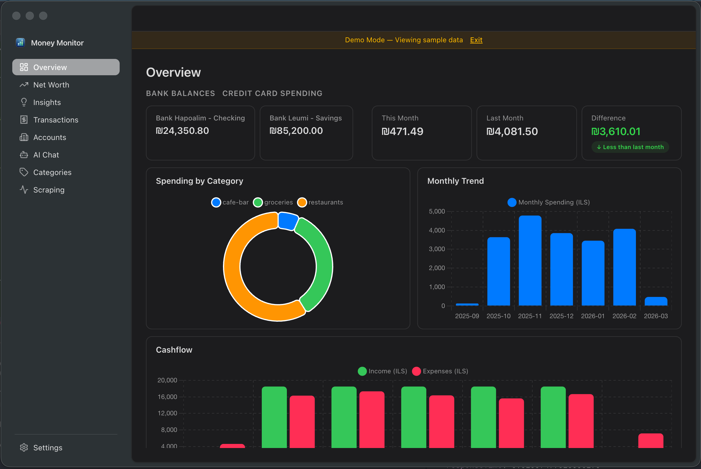 | 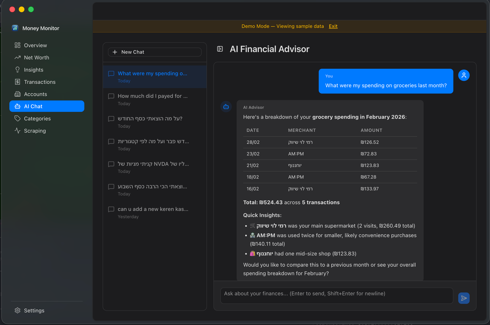 |

| Transactions | Accounts |
|---|---|
| 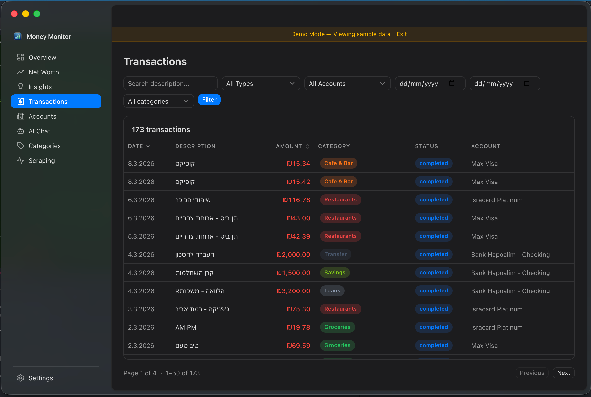 | 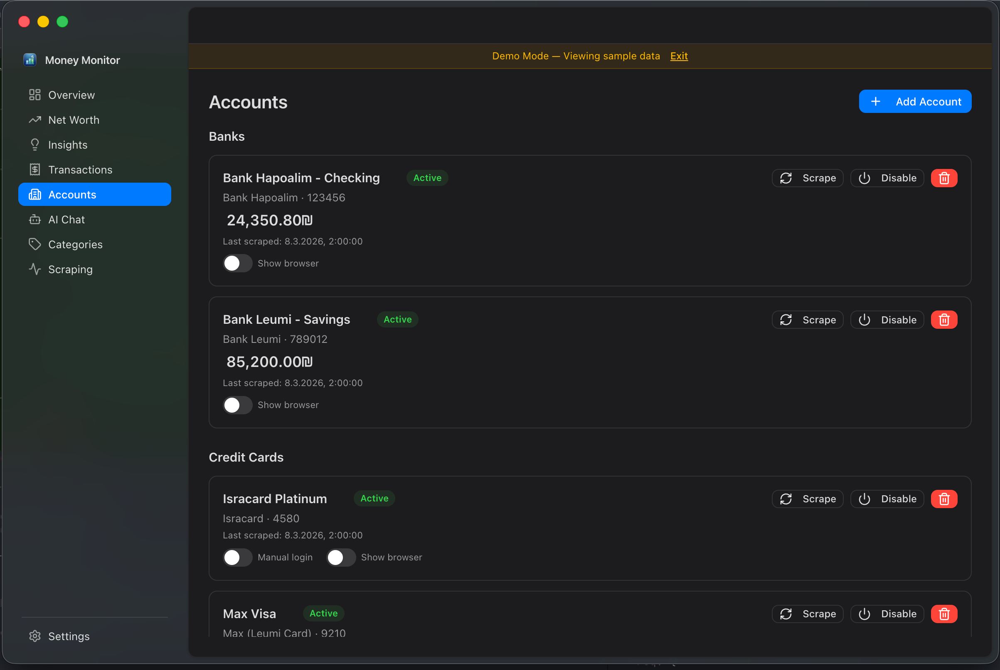 |

| Net Worth | Insights |
|---|---|
| 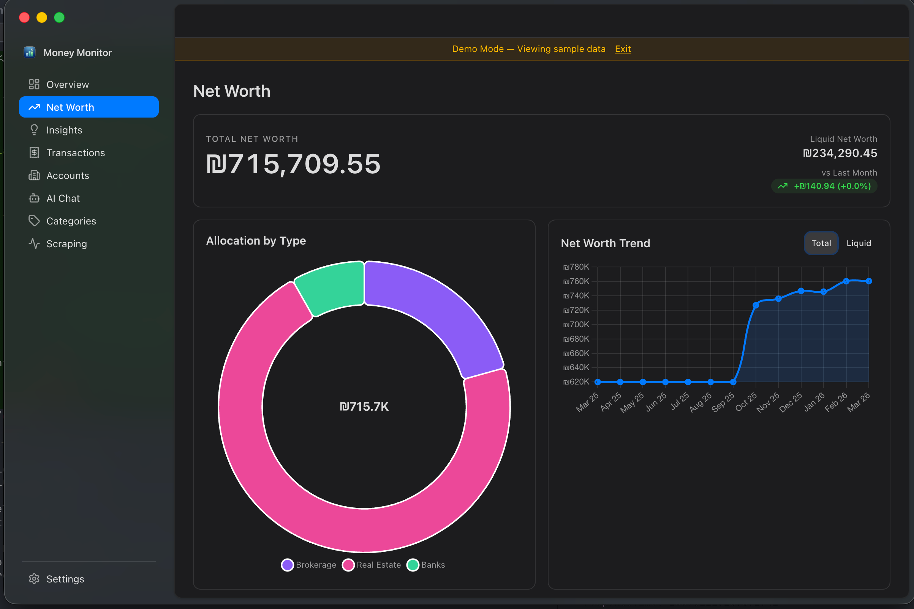 | 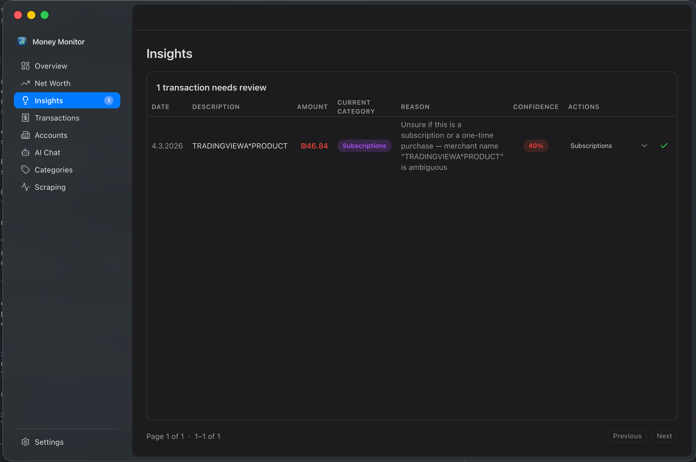 |

| Scraping |
|---|
| 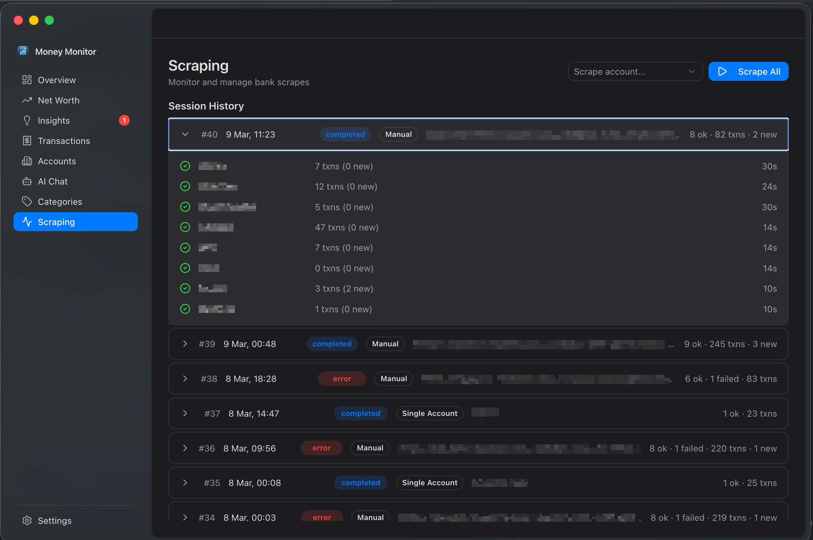 |

## Tech Stack

| Layer | Technology |
|-------|-----------|
| **Backend** | Node.js + TypeScript, Fastify |
| **Frontend** | Vue 3 (Composition API), Vite, Tailwind CSS |
| **Database** | SQLite via better-sqlite3, Drizzle ORM |
| **Scraping** | israeli-bank-scrapers, Puppeteer + Stealth Plugin |
| **AI** | Anthropic Claude SDK (MCP tools for data queries) |
| **Scheduling** | node-cron (Israel timezone) |
| **Charts** | Chart.js + vue-chartjs |
| **UI Components** | Reka UI (headless), Lucide icons |
| **Validation** | Zod |

## Architecture

### System Overview

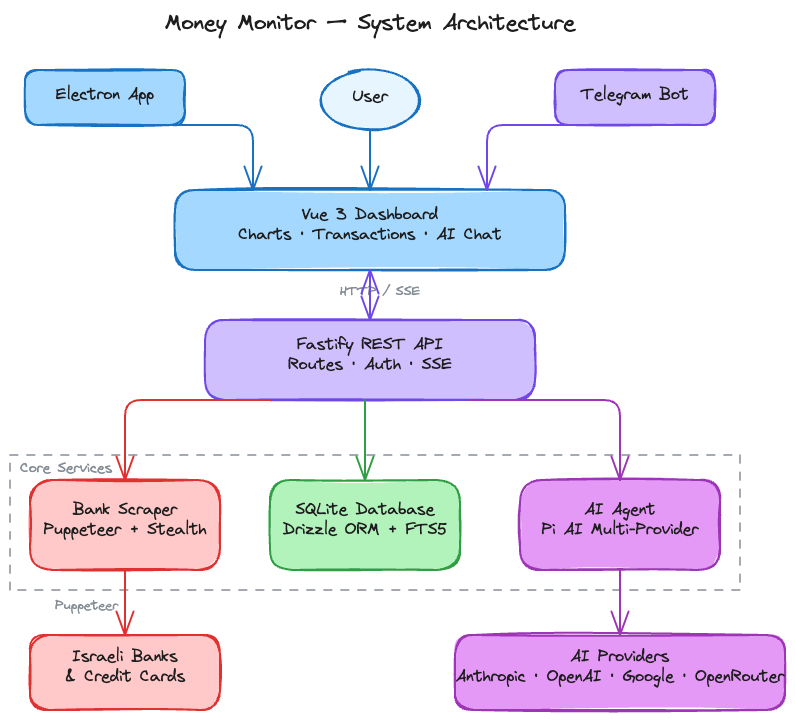

### Scraping Flow

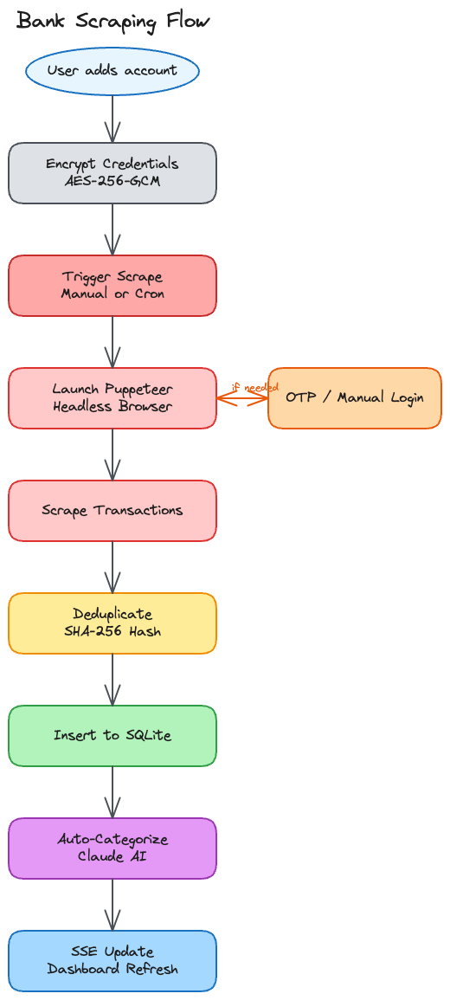

### AI Chat Flow

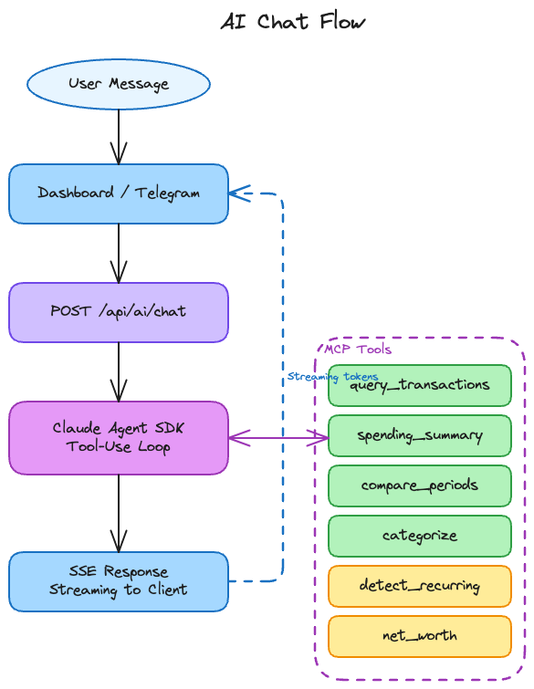

### Data Flow

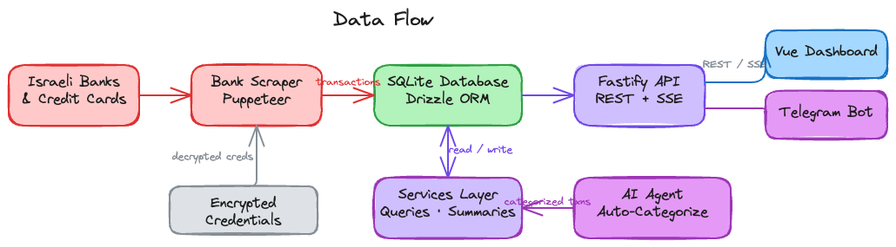

## Supported Institutions

**Banks:** Hapoalim, Leumi, Discount, Mizrahi Tefahot, Otsar Hahayal, Mercantile, Massad, Beinleumi, Union, Yahav, OneZero

**Credit Cards:** Isracard, Amex (Israel), Max (Leumi Card), Visa Cal, Beyond (Beyahad Bishvilha), Behatsdaa, Pagi

## Prerequisites

- **Node.js** 18 or later
- **npm**
- **Anthropic API key** (for AI features — get one at [console.anthropic.com](https://console.anthropic.com))

## Local Setup

### 1. Clone and install dependencies

```bash
git clone https://github.com/saar120/money-monitor.git
cd money-monitor
npm install
cd dashboard && npm install && cd ..
```

### 2. Configure environment

```bash
cp .env.example .env
```

Edit `.env` with your values:

```env
# Server
PORT=3000
HOST=127.0.0.1

# Protect API routes (recommended)
API_TOKEN=<generate with: openssl rand -hex 32>

# Encrypt stored bank credentials (required)
CREDENTIALS_MASTER_KEY=<generate with: openssl rand -hex 32>

# Scraping schedule
SCRAPE_CRON="0 6 * * *"
SCRAPE_TIMEZONE=Asia/Jerusalem
SCRAPE_START_DATE_MONTHS_BACK=3

# AI (required for AI features)
ANTHROPIC_API_KEY=<your-api-key>
ANTHROPIC_MODEL=claude-sonnet-4-6

# Dashboard API URL
VITE_API_URL=http://localhost:3000
```

### 3. Run in development

Start the backend and frontend in two terminals:

```bash
# Terminal 1 — Backend (auto-reloads on changes)
npm run dev

# Terminal 2 — Frontend (Vite dev server)
npm run dashboard:dev
```

- Backend API: http://localhost:3000
- Dashboard: http://localhost:5173

### 4. Production build

```bash
npm run build    # Compiles TypeScript + builds Vue SPA
npm run start    # Serves API + dashboard from compiled output
```

The production build serves the dashboard as static files through Fastify, so only port 3000 is needed.

## Project Structure

```
money-monitor/
├── src/                        # Backend source
│   ├── index.ts                # Server entry point + scheduler
│   ├── config.ts               # Zod-validated env config
│   ├── api/                    # Route handlers
│   │   ├── accounts.routes.ts
│   │   ├── transactions.routes.ts
│   │   ├── scrape.routes.ts
│   │   ├── summary.routes.ts
│   │   ├── ai.routes.ts
│   │   └── categories.routes.ts
│   ├── ai/                     # Claude integration + MCP tools
│   ├── db/                     # Schema, connection, migrations
│   ├── scraper/                # Bank scraping + credential encryption
│   └── shared/                 # Shared types
├── dashboard/                  # Vue 3 SPA
│   └── src/
│       ├── components/         # Pages and UI components
│       ├── api/                # HTTP client
│       └── composables/        # Vue composables
├── .env.example                # Environment template
├── drizzle.config.ts           # ORM configuration
└── package.json
```

## Available Scripts

| Script | Description |
|--------|-------------|
| `npm run dev` | Start backend with hot reload (tsx watch) |
| `npm run build` | Compile TypeScript backend + build Vue dashboard |
| `npm run start` | Run production server |
| `npm run dashboard:dev` | Start Vite dev server for the dashboard |
| `npm run db:generate` | Generate Drizzle migration from schema changes |
| `npm run db:studio` | Open Drizzle Studio (interactive DB browser) |
| `npm run backup` | Back up database, credentials, and `.env` to a timestamped archive |
| `npm run restore` | Restore from the latest backup (or specify an archive path) |

## Backup & Restore

All your data lives in three files. The backup script bundles them into a single `.tar.gz` archive:

| File | Contents |
|------|----------|
| `data/money-monitor.db` | Transactions, accounts, categories, scrape logs |
| `data/credentials.enc` | Encrypted bank login credentials |
| `.env` | Master key, API tokens, and configuration |

### Create a backup

```bash
npm run backup                        # saves to ./backups/
npm run backup -- /path/to/usb/drive  # saves to a custom directory
```

### Restore on another machine

```bash
git clone https://github.com/saar120/money-monitor.git
cd money-monitor
npm install && cd dashboard && npm install && cd ..

# Restore from archive
npm run restore -- /path/to/money-monitor-backup-20260305_120000.tar.gz

npm run dev
```

Running `npm run restore` with no arguments restores the latest archive from `./backups/`.

## License

ISC
