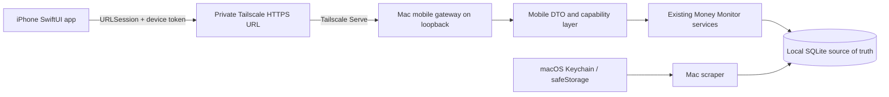

# Architecture

## Target topology



The iPhone never connects to SQLite, runs scraper code, or receives bank credentials. Tailscale is the private transport; the Mac app remains the application server.

## Implemented packaged-Mac boundary

Phase 0 closed the original full-desktop-token gap. The packaged Electron composition now:

- keeps both the desktop and isolated mobile Fastify listeners on loopback;
- maintains a stable private Tailscale HTTPS route to the mobile listener even when local ports change;
- registers only the mobile allowlist under `/api/mobile/v1` on that listener;
- issues a unique scoped device credential after short-lived proof plus explicit Mac approval;
- stores only the credential digest and device audit metadata on the Mac, while the raw credential is device-only in iOS Keychain;
- supports individually named devices, last-use tracking, rotation, and revocation; and
- exposes versioned, masked mobile DTOs rather than desktop database rows.

The full desktop bearer token never enters the pairing payload or iPhone. Binding either listener to `0.0.0.0` remains forbidden because it would expand access to the local network.

## iOS layers

| Layer | Responsibility |
| --- | --- |
| `App` | App lifecycle, environment, top-level routing, privacy cover |
| `Core/Networking` | Base URL, authentication, decoding, retries, typed endpoints |
| `Core/Models` | Stable mobile DTOs and freshness metadata |
| `Core/Persistence` | Encrypted last-known snapshot and schema migration |
| `Core/Security` | Keychain, Face ID, app lock, pairing state |
| `Core/DesignSystem` | Semantic colors, spacing, typography, motion |
| `Features` | Feature-first SwiftUI screens and presentation state |
| `Shared/Components` | Reusable rows, freshness labels, states, and chart summaries |

Feature views should depend on protocols rather than concrete transport or storage types. That keeps previews and tests fixture-driven and preserves the option to change transport later without rewriting the UI.

## Application state model

The root coordinator needs explicit states:

```text
unpaired → pairing → live
                    ↘ cached / stale
                    ↘ authentication revoked
                    ↘ incompatible server
                    ↘ Mac unavailable
```

“Connected” is not enough. Every financial payload needs `generatedAt`, freshness, and API schema version metadata so the interface can truthfully label live versus saved data.

## Cache rules

- Cache only mobile DTOs, never raw database rows or secrets.
- Encrypt the snapshot at rest using a key protected by Keychain.
- Store the snapshot schema version and generated timestamp with the payload.
- Replace snapshots atomically after a complete successful refresh.
- Permit browsing while offline; disable network-only or mutating features.
- Keep one snapshot for at most 30 days, mark it stale after 24 hours, exclude it from backup, and apply D-021 wipe/re-pair behavior.

## Transport and security

- Prefer Tailscale Serve HTTPS so App Transport Security exceptions are unnecessary.
- Use `Authorization: Bearer <device-token>` for protected mobile routes.
- Pinning is not required for the first private Tailnet slice, but normal TLS validation is.
- Never log bearer tokens, raw financial payloads, or merchant search strings in production.
- Redact account identifiers in metrics, crash reports, previews, and screenshots.
