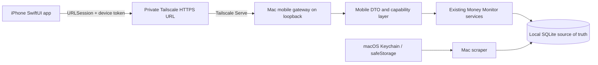

# Architecture

## Target topology



The iPhone never connects to SQLite, runs scraper code, or receives bank credentials. Tailscale is the private transport; the Mac app remains the application server.

## Current gap in the packaged Mac app

Today the Electron process:

- starts Fastify on `127.0.0.1` with port `0`, so the port is random on every launch;
- generates a new 32-byte bearer token for that process;
- gives that token access to the full general-purpose API, including destructive and administrative routes;
- has no `/api/mobile/v1` DTO or capability layer.

Binding Fastify to `0.0.0.0` is not an acceptable shortcut because it expands access to the local network. The Mac app needs a mobile gateway/pairing bridge before real onboarding is complete.

## Phase 0 Mac bridge

The Mac-side bridge should:

1. Keep Fastify and SQLite on loopback.
2. Publish or update a stable private Tailscale HTTPS route for the current backend port.
3. Display a QR pairing payload containing the private base URL, a one-time pairing nonce, and protocol version—not bank credentials.
4. Exchange the nonce for a device-scoped token with read-only capabilities by default.
5. Persist the token encrypted on the Mac and in iOS Keychain.
6. Support device naming, last-used time, expiry, rotation, and revocation.
7. Expose a versioned mobile DTO contract that masks account numbers and omits internal database fields.

## iOS layers

| Layer | Responsibility |
| --- | --- |
| `App` | App lifecycle, environment, top-level routing, privacy cover |
| `Core/Networking` | Base URL, authentication, decoding, retries, typed endpoints |
| `Core/Models` | Stable mobile DTOs and freshness metadata |
| `Core/Persistence` | Encrypted last-known snapshot and schema migration |
| `Core/Security` | Keychain, Face ID, app lock, pairing state |
| `Core/DesignSystem` | Semantic colors, spacing, typography, motion |
| `Features` | Feature-first SwiftUI screens and presentation state |
| `Shared/Components` | Reusable rows, freshness labels, states, and chart summaries |

Feature views should depend on protocols rather than concrete transport or storage types. That keeps previews and tests fixture-driven and preserves the option to change transport later without rewriting the UI.

## Application state model

The root coordinator needs explicit states:

```text
unpaired → pairing → live
                    ↘ cached / stale
                    ↘ authentication revoked
                    ↘ incompatible server
                    ↘ Mac unavailable
```

“Connected” is not enough. Every financial payload needs `generatedAt`, freshness, and API schema version metadata so the interface can truthfully label live versus saved data.

## Cache rules

- Cache only mobile DTOs, never raw database rows or secrets.
- Encrypt the snapshot at rest using a key protected by Keychain.
- Store the snapshot schema version and generated timestamp with the payload.
- Replace snapshots atomically after a complete successful refresh.
- Permit browsing while offline; disable network-only or mutating features.
- Define retention and wipe behavior before implementing the cache.

## Transport and security

- Prefer Tailscale Serve HTTPS so App Transport Security exceptions are unnecessary.
- Use `Authorization: Bearer <device-token>` for protected mobile routes.
- Pinning is not required for the first private Tailnet slice, but normal TLS validation is.
- Never log bearer tokens, raw financial payloads, or merchant search strings in production.
- Redact account identifiers in metrics, crash reports, previews, and screenshots.

