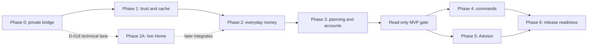

# Money Monitor iOS specification

This folder is the canonical implementation specification for the native iOS app. It turns the approved product direction and mockups into phased, testable work that can be converted into engineering issues without rediscovering scope.

Status: **Draft for implementation review**  
Last updated: **2026-07-16**\
Current milestone: **Phase 2A live Home accepted for the sole technical owner; choose whether to extend the technical lane or resume deferred Phase 1 before the next feature slice**

## How to read the specification

1. Start with [Product specification](PRODUCT_SPEC.md) for the problem, users, goals, scope, requirements, metrics, risks, and open decisions.
2. Read the relevant phase file before creating implementation issues.
3. Apply [Quality gates](QUALITY_GATES.md) to every task and phase exit.
4. Use [Traceability](TRACEABILITY.md) to connect user stories, approved screens, APIs, and validation evidence.
5. Consult the existing [architecture](../Documentation/ARCHITECTURE.md), [API contract](../Documentation/API_CONTRACT.md), [design system](../Documentation/DESIGN_SYSTEM.md), and [screen map](../Documentation/SCREEN_MAP.md) for domain-specific details.

## Phase documents

| Phase | Outcome | Specification | Delivery checkpoint |
| --- | --- | --- | --- |
| 0 | A real iPhone can securely reach a stable, mobile-safe Mac API | [Foundation and private bridge](PHASE_0_FOUNDATION.md) | Internal connectivity prototype |
| 1 | Deferred: app lock, truthful freshness, polished recovery, and encrypted offline viewing | [Trust, security, and resilience](PHASE_1_TRUST_AND_RESILIENCE.md) | Later private dogfood gate |
| 2 | Phase 2A live Home accepted; full phase adds Activity, Search, filters, detail, and cached behavior | [Everyday money](PHASE_2_EVERYDAY_MONEY.md) | Technical-owner live slice, then daily-use read-only slice |
| 3 | Budgets, net worth, assets, accounts, and sync history work read-only | [Planning and connected data](PHASE_3_PLANNING_AND_ACCOUNTS.md) | Recommended read-only MVP |
| 4 | Explicitly approved commands can safely mutate Mac-owned data | [Mobile commands](PHASE_4_MOBILE_COMMANDS.md) | Trusted command release |
| 5 | Advisor works with streaming, freshness disclosure, and a safe tool policy | [Advisor](PHASE_5_ADVISOR.md) | Full mockup capability parity |
| 6 | The app is accessible, localized, resilient, signed, and distributable | [Release readiness](PHASE_6_RELEASE_READINESS.md) | Release candidate |

## Dependency flow

D-018 permitted only the sole technical owner to start Phase 2A from Phase 0; that slice is now accepted. The lane remains live-only and memory-only, pulls forward the app-switcher cover, and cannot claim Phase 1, full Phase 2, private dogfood, or release readiness. The solid dependency path remains mandatory before offline storage or broader distribution. Phase 4 and Phase 5 may proceed in parallel after the read-only contract is stable, but neither may bypass the Phase 0 capability boundary or the deferred Phase 1 security model.

## Task identifiers

Task IDs follow `P{phase}-{area}-{number}`.

| Area | Meaning |
| --- | --- |
| `PRD` | Product decision or specification |
| `DES` | Interaction, visual, or content design |
| `ARC` | Cross-system architecture |
| `MAC` | Electron/Mac lifecycle and desktop UI |
| `API` | Fastify route, contract, DTO, or service boundary |
| `SEC` | Pairing, authentication, authorization, privacy, or Keychain |
| `DAT` | iOS snapshot persistence, migration, and data repository |
| `IOS` | Swift/SwiftUI application work |
| `AI` | Advisor agent, session, or streaming work |
| `QA` | Automated, manual, performance, accessibility, or security validation |
| `REL` | Signing, distribution, operations, and release work |

User stories use `US-P{phase}-{number}`. Global requirements use `REQ-{domain}-{number}` and are mapped in [Traceability](TRACEABILITY.md).

## Status and priority

Task status:

- **Done:** present and verified in the repository.
- **Planned:** sufficiently specified to schedule after dependencies.
- **Blocked:** needs an explicit decision or prerequisite before implementation.
- **Deferred:** intentionally outside the current delivery checkpoint.

Requirement priority:

- **Must:** the phase cannot pass without it.
- **Should:** materially improves the phase but may move to the immediate follow-up.
- **Future:** informs architecture but is not scheduled for the current milestone.

“Phase 0” is a delivery sequence, while “Must/Should/Future” is requirement priority; the two should not be conflated.

## Turning tasks into issues

Each implementation issue should include:

- one task ID and one observable outcome;
- linked user story and global requirement IDs;
- owner area and dependencies;
- implementation notes from the phase file;
- happy-path, failure-path, and negative acceptance criteria;
- test evidence required by `QUALITY_GATES.md`;
- screenshots or fixtures when UI/API output changes.

Split a task if it cannot be reviewed independently or is expected to span more than a few focused development days. Do not combine Mac gateway, server contract, and iOS UI changes into one issue merely because they serve one user journey.

## Change control

- Product scope changes update `PRODUCT_SPEC.md` first.
- Architectural changes add or supersede an entry in [`DECISIONS.md`](../Documentation/DECISIONS.md).
- API changes update [`API_CONTRACT.md`](../Documentation/API_CONTRACT.md), fixtures, and Swift decoder tests together.
- Visual changes update the canonical mockup package under `docs/ios-mockups` before changing this specification's screen references.
- Adding scope to a phase requires removing equivalent scope, moving its exit date, or explicitly changing the delivery checkpoint.
